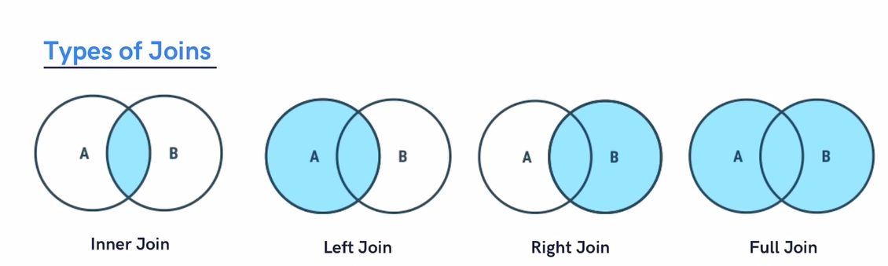

**Copyright @ Anshuman Kundu**

# SQL One shot study
*by Anshuman Kundu*

### Database: It is a place where data is stored. It can be easily accessed digitally with the help of a software called DBMS (Database Management System). 

### There are two types of Databases :
1. Relational : Data is stored in a structured way in a form of a table. (MySQL, Oracle, PostgreSQL, SQL Server, etc.)
2. Non-relational: Data is stored in a randomly unstructured way and not in a form of a table. (MongoDb, etc.)
   
### SQL : Structured Query Language, used to interact with Relational Databases.

### Difference between SEQUEL and SQL : 
1. SEQUEL: Structured(S) English(E) Query(QUE) Language(L)
2. SQL: Structured(S) Query(Q) Language(L)
3. Both are similar, when this language originated it was named SEQUEL and slowly it transformed to SQL.

### What are tables, rows and columns?
1. Tables are a collection of rows and columns.
2. A column basically represents the schema/design of a table which provides the information about what all types of data the table is going to contain.
3. A row is individual data or actual data tallied to the column.

### Basic Querrying on SQL:


```sql
-- Creating and using a databse : create db_name;

create database anshuman; 
use anshuman;

-- Creating a table : create table table_name(column_name1 datatype constraint, ........);

create table projects(
	id int primary key,
    name varchar(50),
    days int not null
);


-- Insert data into the table projects: insert into table_name values (values1), (values2), ....;

insert into projects values (1, "Tripping.Trips", 30), (2, "InfoFusion", 60); 

-- Fetching all the data from the table projects: select * from table_name;

select * from projects;

-- deleting a table

drop table projects;

-- deleting a database

drop database anshuman; 

```


### Datatypes: Defines the type of data which will be stored in a particular column.

.png)


### All the SQL commands can be divided into 5 types:
1. DDL (Data Definition Language): create, alter, truncate, drop, etc.
2. DQL (Data Query Language): select
3. DML (Data Manipulation Language): insert, update, delete
4. DCL (Data Control Language): grant or revoke usage permissions
5. DTL (Data Transaction Language): commit, transaction, rollback, etc.

### Database related Queries:

```sql
-- Creating database

create database anshuman;
create database if not exists anshuman;

-- Dropping database

drop database anshuman;
drop database if exists anshuman; 

-- Show databases and tables

show databases;
use analytics;
show tables;

```

### Table related queries:
```sql
create database company;
use company;

-- Creating a table to store employee info (id, name, salary) 

create table employees(
	id int primary key,
    name varchar(50) not null,
    salary int not null
);

-- Inserting data into employee table

insert into employees
(id, name, salary)
values
(1, "adam", 25000),
(2, "bob", 30000),
(3, "casey", 40000);

-- Select and view table data

select * from employees; 
 
```

### Primary Keys:
1. A column in a table which uniquely identifies each row of that column.
2. There can be only one Primary Key.
3. It is unique in every single row entry and it is not null.
4. We can make a set of columns combined a primary key as well:
```sql
    create table student(
        id int not null,
        name varchar(50) not null,
        age int not null,
        primary key (id, name)
    );
```
5. In the above scenario id can be not unique and name can be not unique but the combination of both should always be unique because it's a primary key.

### Foreign Keys: 
1. Let suppose there are two tables A and B.
2. A has a primary key named column x and B has a column y.
3. So column y in table B can become a foreign key which refers to the primary key in Column A and this way establishes a relation between both the tables.
4. There can be more than one foreign keys and can be filled with null values. 
``` sql
   create table temp(
	emp_id int, 
    foreign key (emp_id) references employees(id)
);
```

### Constraints:
1. not null : This ensures the column cannot have null values.
2. unique: This ensures the column values are unique.
3. default: sets default value of a column if null is entered.
4. check: Limits the value allowed in a column.
```sql
    create table any(
        id int primary key,
        name varchar(50) not null,
        username varchar(10) unique,
        income int default 25000 check (income>=20000),
        city varchar(10) not null,
        age int not null,
        constraint age_city_check check (age>=18 and city="Delhi")
    );
```


### Details select statement:
```sql
-- Display specific columns 
select name, marks from student;

-- Display all columns
select * from student;

-- Display distinct column values
select distinct city from student; 

-- where clause
select * from student where marks>=80;
select * from student where city='Mumbai' and marks>=80;

-- Operators
select * from student where marks+10>100; 
select * from student where marks=93;
select * from student where marks>90 AND marks<94;
select * from student where marks between 80 and 90;
select * from student where city not in ("Mumbai", "Delhi");

-- Limit
select * from student limit 3; 

-- Order By Clause
select * from student order by city asc; 
select * from student order by marks desc;

-- Aggregate Functions
-- count
select count(*) from student;

-- max
select max(marks)from student; 

-- min
select min(marks) from student; 

-- sum
select sum(marks) from student;

-- avg
select avg(marks) from student; 
```

### Group by clause: This collects data from multiple records and displays by grouping them all at once.

```sql
    select city, count(name) from student
    group by city;
```

### Having clause: Similar to *where* clause it helps us apply conditions but the differnce is *where* helps us define conditions on rows but *having* helps us define conditions on groups i.e it can be used after the group by.
```sql
select city, count(name), avg(marks) from student
group by city
having max(marks)>90;
```

### General Order of commands to be written in SQL
1. select column(s)
2. from table_name
3. where condition 
4. group by column(s)
5. having condition
6. order by column(s) asc/desc

### Other table related queries
1. Update: 
   ```sql
    update student
    set grade='O'
    where grade='A';
   ```
2. Delete:
   ```sql
    delete from student
    where marks<33;
   ```

### Revisiting Foreign Keys:
```sql
create database college;
use college;


create table dept(
	id int primary key,
    name varchar(10) not null
);

create table teacher(
	id int primary key,
    name varchar(10) not null,
    dept_id int,
    foreign key (dept_id) references dept(id)
    on update cascade
    on delete cascade
);

insert into dept
(id, name)
values
(101, "Science"),
(102, "English"),
(103, "Hindi");

insert into teacher
(id, name, dept_id)
values
(101, "Adam", 101),
(102, "Bob", 103),
(103, "Casey", 102),
(104, "Donald", 102);
```


#### Cascading : Whenever there is a change(update/delete) in the parent table which has the primary key being referrenced by some foreign key in the child table, on update cascade and on delete cascade will reflect the changes to child table as well which contains the foreign key referrencing the parent table.


### Alter Query: Helps in altering the schema of the table.
1. Add Column:
   ```sql
        alter table table_name,
        add column column_name datatype constraints
   ```
2. Drop Column:
   ```sql
        alter table table_name,
        drop column column_name
   ```
3. Rename table:
   ```sql
        alter table table_name,
        rename to new_table_name
   ```
4. Change Column:
   ```sql
        alter table table_name,
        change column old_column_name new_column_name new_datatype new_constraints
   ```
5. Modify Column:
   ```sql
        alter table table_name,
        modify column_name new_datatype new_constraints
   ```

### Truncate Query: Deletes all the data inside the table and keeps the table
```sql
    truncate table_name
```

### SQL Joins: Joins in SQL are used to combine two or more columns based on a related column between them.



##### Inner Join: Returns records which are common in both table A and table B.

```sql
select column(s)
from table_A
inner join table_B
on table_A.col_name=table_B.col_name
```

Example: 
```sql
create table student(
	student_id int primary key,
    name varchar(50) not null
);

create table courses(
	student_id int primary key,
    course varchar(50) not null
);

insert into student
(student_id, name)
values
(101, "Adam"),
(102, "Bob"),
(103, "Casey");

insert into courses
(student_id, course)
values
(102, "English"),
(105, "Math"),
(103, "Science"),
(107, "CSE");

select * 
from student as a
inner join courses as b
on a.student_id=b.student_id
```

##### Left Join: Returns all the records from the left table and the common records from both the tables, i.e it will return records in both the tables except the records only in the right table.

```sql
select column(s)
from table_A
left join table_B
on table_A.col_name=table_B.col_name
```

Exmaple:
```sql
select *
from student as a
left join courses as b
on a.student_id=b.student_id;
```

##### Right Join: Returns all the records from the right table and the common records from both the tables, i.e it will return records in both the tables except the records only in the left table.

```sql
select column(s)
from table_A
right join table_B
on table_A.col_name=table_B.col_name
```

Exmaple:
```sql
select *
from student as a
right join courses as b
on a.student_id=b.student_id;
```

##### Full Join: Returns all the data from the left table, right table and the common data between them.

```sql
select column(s)
from table_A
left join table_B
on table_A.col_name=table_B.col_name
union
select column(s)
from table_A
right join table_B
on table_A.col_name=table_B.col_name
```


##### Left Exclusive Join: Provide records only from the left table and not in the right table and not in common records.

```sql
select *
from student as a
left join courses as b
on a.student_id=b.student_id
where b.student_id is null;
```

##### Right Exclusive Join: Provide records only from the right table and not in the left table and not in common records.

```sql
select *
from student as a
right join courses as b
on a.student_id=b.student_id
where a.student_id is null;
```

##### Common Exclusive Join: Provide records from the left and the right table excluding the common records.
```sql
select * 
from student as a
left join courses as b
on a.student_id=b.student_id
where b.student_id is null
union
select * 
from student as a
right join courses as b
on a.student_id=b.student_id
where a.student_id is null
```

### SQL Subqueries: Queries inside SQL Queries (nested SQL queries)

Data: 
```sql
create table student(
	rollno int primary key,
    name varchar(50) not null,
    marks int not null
);

insert into student
(rollno, name, marks)
values
(101, "Anil", 78),
(102, "Bhumika", 93),
(103, "Chetan", 85),
(104, "Dhruv", 96),
(105, "Emanuel", 92),
(106, "Farah", 82);
```

Example 1: Get names of all the students who scored more than the class average

Answer:
```sql
select name
from student
where marks > 
(select avg(marks) from student);
```

Example 2: Get names of all the students with even roll numbers

Answer: 
```sql
select name
from student
where rollno in 
(select rollno
from student
where rollno%2=0);
```

### SQL Views: It is a virtual table based on the result set of a sql statement.

```sql
create view marks as
select marks from student;
select * from marks;
```

The above statement creates a virtual table marks by taking the results of marks query from student. This marks table can queried for further querrying.